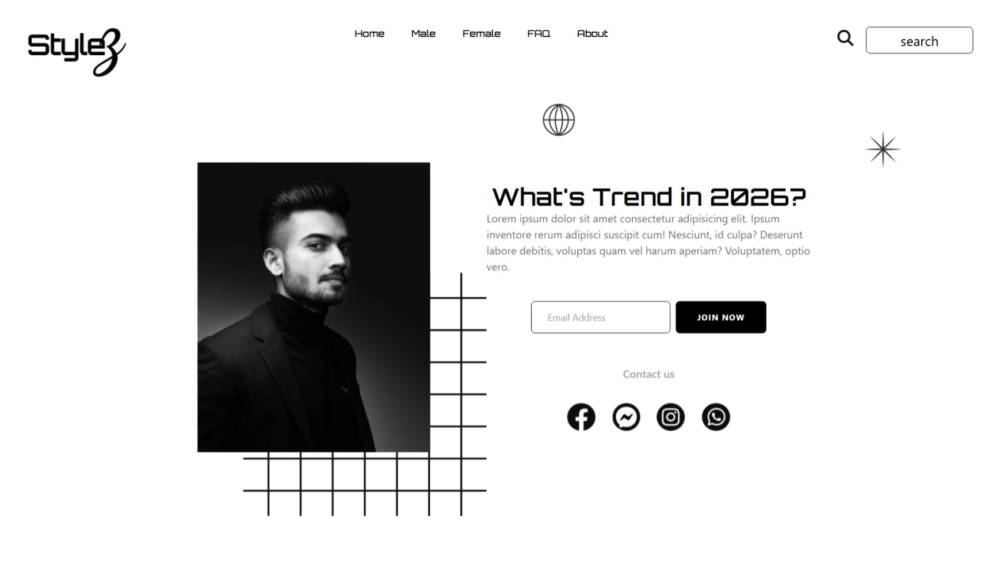

# StyleZ | 2026 Trends 👗✨

A modern, responsive fashion landing page built using **HTML** and **Tailwind CSS**, designed to showcase upcoming style trends for 2026. This project focuses on clean UI, responsive design, and smooth user interactions.

---

## 🚀 Features

* 📱 **Fully Responsive Design** (Mobile → Desktop)
* 🎨 **Modern UI/UX Layout**
* 🔤 **Custom Google Fonts Integration** (Poppins, Orbitron, Michroma, Roboto)
* ⚡ **Tailwind CSS Utility-Based Styling**
* 🎯 **Interactive Hover Effects & Transitions**
* 🔍 **Search Bar & Email Subscription Section**
* 🌐 **Social Media Icons Integration**
* 📦 **Optimized Layout with Flexbox & Positioning**

---

## 🛠️ Tech Stack

* **HTML5**
* **Tailwind CSS (CDN)**
* **Font Awesome Icons**
* **Google Fonts**

---

## 📁 Project Structure

```
project/
│
├── index.html
├── img.png
├── Image.png
├── globe.png
├── star.png
├── squares.png
├── Group.png
├── Group (1).png
├── Group (2).png
└── Group (3).png
```

---

## ⚙️ Setup & Usage

1. Clone or download this repository
2. Make sure all image assets are placed correctly in the project folder
3. Open `index.html` in your browser

No build tools or installation required — everything runs via CDN.

---

## 💡 Key Highlights

* Uses **Tailwind config customization** for fonts
* Clean separation of **navigation, hero section, and contact area**
* Responsive behavior handled with Tailwind breakpoints (`lg`, `xl`, etc.)
* Minimal and scalable structure for future expansion

---

## 📸 Preview

A sleek fashion landing page highlighting upcoming trends, with a bold headline, image composition, and call-to-action for user engagement.

[live](https://elbineldhose007.github.io/stylez/)



---

## 🔮 Future Improvements

* Add backend for email subscription
* Implement dark mode 🌙
* Improve accessibility (ARIA labels, semantic HTML)
* Add animations using libraries like Framer Motion

---

## 👤 Author

Developed by **Anandhu Es**

---

## 📄 License

This project is open-source and free to use for learning and development purposes.

---

✨ *Stay trendy. Stay ahead.*
